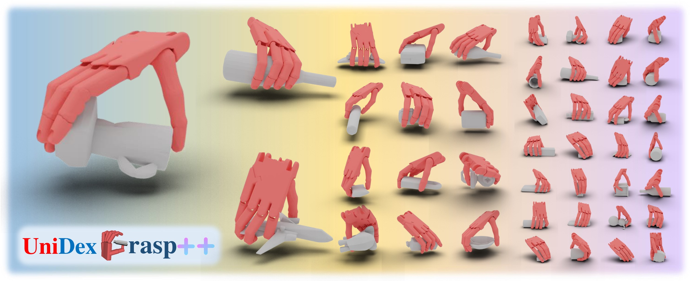

<h2 align="center">
  <b>UniDexGrasp++: Improving Dexterous Grasping Policy Learning via Geometry-aware Curriculum and Iterative Generalist-Specialist Learning</b>

<div align="center">
    <a href="https://arxiv.org/abs/2304.00464" target="_blank">
    </a>
    <a href="https://pku-epic.github.io/UniDexGrasp++/" target="_blank">
    </a>
</div>
</h2>

This is the official repository of [**UniDexGrasp++: Improving Dexterous Grasping Policy Learning via Geometry-aware Curriculum and Iterative Generalist-Specialist Learning**](https://arxiv.org/abs/2304.00464).

For more information, please visit our [**project page**](https://pku-epic.github.io/UniDexGrasp++/).

## Update
[2023.10.29] Release code and state-based checkpoints and results summary.

## Overview

In this work, we present a novel dexterous grasping policy learning pipeline, **UniDexGrasp++**. Same to UniDexGrasp, UniDexGrasp++ is trained on 3000+ different object instances with
random object poses under a table-top setting. It significantly outperforms the previous
SOTA and achieves **85.4%** and **78.2%** success rates on the train and test set.

## Pipeline

We propose a novel, object-agnostic method for learning a universal policy for dexterous 
object grasping from realistic point cloud observations and proprioceptive information 
under a table-top setting, namely UniDexGrasp++. To address the challenge of learning 
the vision-based policy across thousands of object instances, we propose Geometry-aware 
Curriculum Learning (**GeoCurriculum**) and Geometry-aware iterative Generalist-Specialist 
Learning (**GiGSL**) which leverage the geometry feature of the task and significantly improve 
the generalizability. With our proposed techniques, our final policy shows universal 
dexterous grasping on thousands of object instances with **85.4%** and **78.2%** success rate 
on the train set and test set which outperforms the state-of-the-art baseline UniDexGrasp 
by **11.7%** and **11.3%**, respectively.


## Installation

Details regarding installation of IsaacGym can be found [here](https://developer.nvidia.com/isaac-gym). We test with `Preview Release 3/4` and `Preview Release 4/4` version of IsaacGym and use the `Preview Release 3/4` in our paper experiment.

Please follow the steps below to perform the installation：


### 1. Create virtual environment
```bash
conda create -n dexgrasp python==3.8
conda activate dexgrasp
```

### 2. Install isaacgym
Once you have downloaded IsaacGym:
```bash
cd <PATH_TO_ISAACGYM_INSTALL_DIR>/python
pip install -e .
```
Ensure that Isaac Gym works on your system by running one of the examples from the `python/examples` 
directory, like `joint_monkey.py`. Please follow troubleshooting steps described in the Isaac Gym Preview Release 3/4
install instructions if you have any trouble running the samples.

### 3. Install dexgrasp
Once Isaac Gym is installed and samples work within your current python environment, install this repo from source code:
```bash
cd <PATH_TO_DEXGRASP_POLICY_DIR>
pip install -e .
```
```
cd DexGrasp-test
pip install -e .
```

### 4. Install pointnet2_ops
```bash
pip install "git+https://github.com/erikwijmans/Pointnet2_PyTorch.git#egg=pointnet2_ops&subdirectory=pointnet2_ops_lib”
```
## Dataset
We use the UniDexGrasp [dataset](https://mirrors.pku.edu.cn/dl-release/UniDexGrasp_CVPR2023/dexgrasp_policy/assets/). Addtionaly please download [datasetv4.1_posedata.npy](https://drive.google.com/file/d/1DajtOFyTPC5YhsO-Fd3Gv17x7eAysI1b/view?usp=share_link) under `assets`. Please unpack them put them under the directory dexgrasp_policy/assets. The full objects and their corresponding scales informations we used are in dexgrasp/cfg/train_set.yaml, dexgrasp/cfg/test_set_seen_cat.yaml, dexgrasp/cfg/test_set_unseen_cat.yaml.

## Training/Evaluation
We provide two tasks: for the state-based policy task, please see `dexgrasp/tasks/shadow_hand_grasp.py`; Please modify `object_code_dict` in `cfg/shadow_hand_grasp.yaml` in order to change the training objects; for the vision-based policy tasks, in order to train on more objects within a certain GPU memory limit, we randomly load objects from the dataset in the beginning of each episode during training. please see `dexgrasp/tasks/shadow_hand_random_load_vision.py`.

Run the following lines in `dexgrasp` folder.

training state-based policy training using ppo:
```bash
bash script/run_train_ppo_state.sh 
```

training state-based policy distillation using DAgger (Please modify `expert` in `dexgrasp/cfg/dagger_value` in order to assign training objects with different teacher policy):
```bash
bash script/run_train_dagger_state.sh 
```

training state to vision policy distillation using DAgger:
```bash
bash script/run_train_dagger_state_to_vision.sh
```

training vision-based policy training using ppo:
```bash
bash script/run_train_ppo_vision.sh
```


Add `--test` in the training scripts for evaluation. For more provided args (e.g., backbone type, test mode), please check these scripts and `utils/config.py`.

## Results and Checkpoints
We provide our trained state-based policy checkpoint at dexgrasp/state_based_model and its detailed evaluation results on all training and test objects at `results/state_based/train_set_results.yaml`, `results/state_based/test_set_seen_cat_results.yaml`, `results/state_based/test_set_unseen_cat_results.yaml`.

## Acknowledgement
The code base used in this project is sourced from these repository:

[NVIDIA-Omniverse/IsaacGymEnvs](https://github.com/NVIDIA-Omniverse/IsaacGymEnvs)

[PKU-MARL/DexterousHands](https://github.com/PKU-MARL/DexterousHands)

[PKU-EPIC/UniDexGrasp](https://github.com/PKU-EPIC/UniDexGrasp)

## Citation
If you find our papers helpful, please consider cite:
```
@article{xu2023unidexgrasp,
  title={UniDexGrasp: Universal Robotic Dexterous Grasping via Learning Diverse Proposal Generation and Goal-Conditioned Policy},
  author={Xu, Yinzhen and Wan, Weikang and Zhang, Jialiang and Liu, Haoran and Shan, Zikang and Shen, Hao and Wang, Ruicheng and Geng, Haoran and Weng, Yijia and Chen, Jiayi and others},
  journal={arXiv preprint arXiv:2303.00938},
  year={2023}
}
@article{wan2023unidexgrasp++,
  title={UniDexGrasp++: Improving Dexterous Grasping Policy Learning via Geometry-aware Curriculum and Iterative Generalist-Specialist Learning},
  author={Wan, Weikang and Geng, Haoran and Liu, Yun and Shan, Zikang and Yang, Yaodong and Yi, Li and Wang, He},
  journal={arXiv preprint arXiv:2304.00464},
  year={2023}
}
```

## License
This work and the dataset are licensed under [CC BY-NC 4.0][cc-by-nc].

[![CC BY-NC 4.0][cc-by-nc-image]][cc-by-nc]

[cc-by-nc]: https://creativecommons.org/licenses/by-nc/4.0/
[cc-by-nc-image]: https://licensebuttons.net/l/by-nc/4.0/88x31.png
