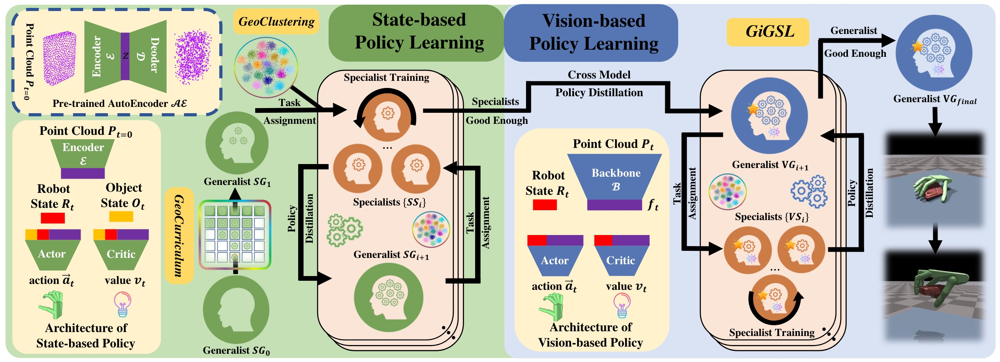

<h2 align="center">
  <b>UniDexGrasp++: Improving Dexterous Grasping Policy Learning via Geometry-aware Curriculum and Iterative Generalist-Specialist Learning</b>

    
    

</h2>

This is the official repository of [**UniDexGrasp++: Improving Dexterous Grasping Policy Learning via Geometry-aware Curriculum and Iterative Generalist-Specialist Learning**](https://arxiv.org/abs/2304.00464).

For more information, please visit our [**project page**](https://pku-epic.github.io/UniDexGrasp++/).

## Overview

In this work, we present a novel dexterous grasping policy learning pipeline, **UniDexGrasp++**. Same to UniDexGrasp, UniDexGrasp++ is trained on 3000+ different object instances with
random object poses under a table-top setting. It significantly outperforms the previous
SOTA and achieves **85.4%** and **78.2%** success rates on the train and test set.

## Pipeline

We propose a novel, object-agnostic method for learning a universal policy for dexterous 
object grasping from realistic point cloud observations and proprioceptive information 
under a table-top setting, namely UniDexGrasp++. To address the challenge of learning 
the vision-based policy across thousands of object instances, we propose Geometry-aware 
Curriculum Learning (**GeoCurriculum**) and Geometry-aware iterative Generalist-Specialist 
Learning (**GiGSL**) which leverage the geometry feature of the task and significantly improve 
the generalizability. With our proposed techniques, our final policy shows universal 
dexterous grasping on thousands of object instances with **85.4%** and **78.2%** success rate 
on the train set and test set which outperforms the state-of-the-art baseline UniDexGrasp 
by **11.7%** and **11.3%**, respectively.